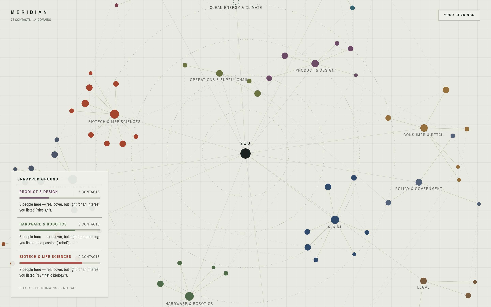

# MERIDIAN

[](https://github.com/Lucassnam/meridian/actions/workflows/ci.yml)

A network survey you can read at a glance. Your contacts are laid out as a
force directed graph around you, grouped into domains, so the shape of your
network and the gaps in it are visible without reading a single row of a table.

**[Open the live survey](https://meridian-seven-psi.vercel.app)**



## The idea

Most contact tools answer "who do I know". This one answers "where am I thin".

Each contact is a node, pulled toward its domain cluster and tethered to you at
the centre. Node size tracks how strong the tie is. The **Unmapped Ground**
panel then does the part people actually want: it cross references the domains
you said you care about against the domains you have real coverage in, and
ranks the gaps.

So a reading like "5 people here, real cover, but light for an interest you
listed" is the product. The graph is how you see it, not the point of it.

## Interface

- Full bleed canvas, no chrome competing with the data
- Floating overlays for the header, the gap panel and the bearings control
- Domain labels sit with their clusters rather than in a separate legend
- Colour encodes domain, radius encodes tie strength

## Stack

TypeScript, Vite, and a hand rolled force simulation. No charting library, no
backend, no build step beyond Vite.

## Running it locally

```bash
npm ci
npm run dev
```

Then open the URL Vite prints. `npm run build` produces the static bundle that
Vercel serves.
